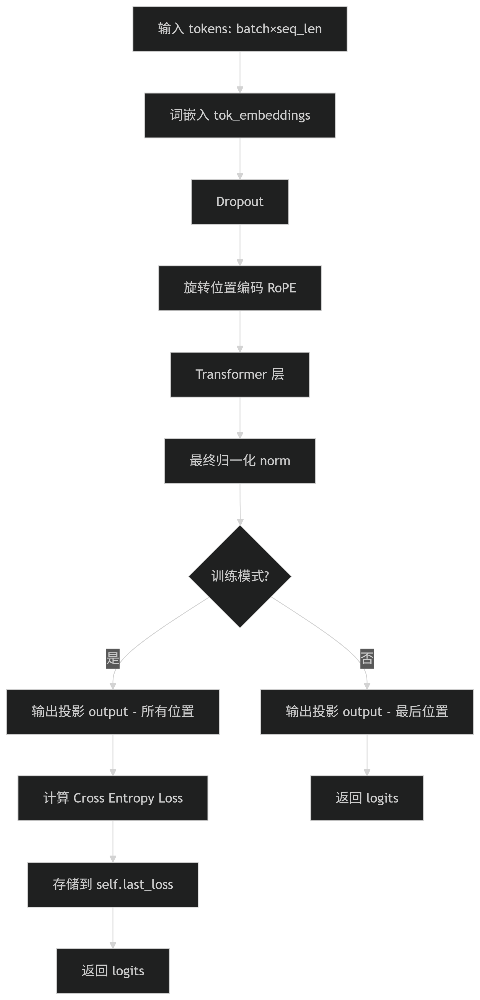
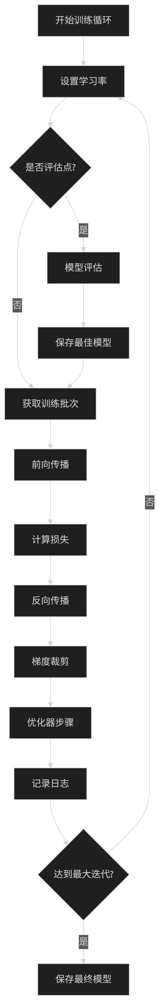
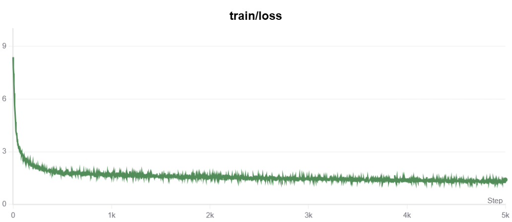

## 📋 目录

- 项目概述

- 项目架构

- 项目构建详细拆解

- 训练结果

## 🎯 项目概述

### 项目简介

TinyLLM是一个从零开始实现的小型语言模型，基于Transformer架构，用于学习和理解大语言模型的工作原理。

### 技术栈

- **深度学习框架**: PyTorch 2.0+

- **分词器**: SentencePiece

- **数据集**: [TinyStories](https://www.modelscope.cn/datasets/AI-ModelScope/TinyStories)

- **优化器**: AdamW

- **学习率调度**: Cosine Annealing with Warmup

- **加速技术**: torch.compile

### 模型规模

- **参数量**: 7.3M

- **词汇表大小**: 4096

- **最大序列长度**: 256

- **隐藏维度**: 288

- **层数**: 6

- **注意力头数**: 6

## 🏗️ 项目架构

### 目录结构

```Plain Text
TinyLLM/
├── src/                    # 源代码
│   ├── config/            # 配置文件
│   │   └── config.py      # 模型和训练配置
│   └── checkpoints/           # 模型检查点
│   │   └── final_checkpoint.ckpt
│   ├── train_vocab.py     # 训练tokenizer
│   ├── model.py           # 模型定义
│   ├── data_utils.py      # 数据处理工具
│   ├── train.py           # 训练脚本
│   └── test.py            # 推理脚本
├── data/                  # 数据目录
│   └── TinyStories/   
│       └── data/
│           └── train-*.parquet # 原始数据
│
├── download_data.sh
└── README.md             # 项目说明
```

## 🔧 项目构建详细拆解

### (1) Tokenizer的训练

**tokenizer作用**：文本转换为数字序列

由于TinyStories数据集的词汇量有限，采用**BPE（Byte Pair Encoding）算法**，**词汇表大小设置为4096**

```Shell
modelscope download --dataset 'AI-ModelScope/TinyStories' --local_dir '/home/suxin/tinyllm/data/TinyStories'
```

```Python
import os
import pyarrow.parquet as pq
from pathlib import Path
import sentencepiece as spm
import tempfile

def train_vocab(data_dir, vocab_size=4096, model_name="vocab"):
    """
    Args:
        data_dir:数据目录路径
        vocab_size:词汇表大小
        model_name:模型名
    Returns:
        模型文件路径
    """
    print(f"开始训练词汇表，词汇表大小： {vocab_size}")

    print("Step 1: 准备训练语料...")
    temp_file = tempfile.NamedTemporaryFile(mode='w', delete=False, suffix='.txt', encoding='utf-8')
    data_path = Path(data_dir)
    parquet_files = list(data_path.glob("train-*.parquet"))
    
    text_count = 0
    for file_path in parquet_files:
        print(f"处理文件: {file_path.name}")
        
        # 读取parquet文件
        pf = pq.ParquetFile(file_path)
        for batch in pf.iter_batches(columns=["text"], batch_size=50000):
            texts = batch["text"].to_pylist()
            
            for text in texts:
                if text and len(str(text).strip()) > 10:  # 过滤太短的文本
                    temp_file.write(str(text).strip() + '\n')
                    text_count += 1
                    
                    if text_count % 10000 == 0:
                        print(f"已处理 {text_count} 条文本")
    
    temp_file.close()
    print(f"语料准备完成，共 {text_count} 条文本")
    
    # 步骤2: 训练SentencePiece模型
    print("Step 2: 训练SentencePiece模型...")
    
    try:
        spm.SentencePieceTrainer.train(
            input=temp_file_path,                    # 输入文件路径
            model_prefix=model_name,                 # 输出模型前缀
            vocab_size=vocab_size,                   # 词汇表大小：4096个token
            model_type="bpe",                        # 算法类型：BPE（字节对编码）
            character_coverage=0.9995,               # 字符覆盖率：99.95%的字符被包含
            num_threads=os.cpu_count(),              # 并行线程数：使用所有CPU核心
            pad_id=0,                                # 填充token ID
            unk_id=1,                                # 未知token ID  
            bos_id=2,                                # 句子开始token ID
            eos_id=3,                                # 句子结束token ID
            input_sentence_size=10_000_000,          # 最大输入句子数：1000万句
            shuffle_input_sentence=True              # 打乱输入句子顺序
        )
        
        print(f"✅ 词汇表训练完成!")
        print(f"模型文件: {model_name}.model")
        print(f"词汇文件: {model_name}.vocab")
        
    finally:
        # 清理临时文件
        os.unlink(temp_file.name)
    
    return f"{model_name}.model"

model_path = train_vocab("/home/suxin/tinyllm/data/TinyStories/data", vocab_size=4096, model_name="TinyStories4096")
```

### (2) 分词器类实现

```Python
import os
import torch
import sentencepiece as spm
import pyarrow.parquet as pq
from pathlib import Path
import random

class TinyStoriesTokenizer:
    def __init__(self, model_path):
        """
        初始化tokenizer
        Args:
            model_path: SentencePiece模型文件路径(.model文件)
        """
        
        self.sp = spm.SentencePieceProcessor()
        
        self.sp.load(model_path)
        print(f"✅ 成功加载SentencePiece模型: {model_path}")
        
        # 获取特殊token ID
        self.pad_id = self.sp.pad_id()
        self.unk_id = self.sp.unk_id()
        self.bos_id = self.sp.bos_id()
        self.eos_id = self.sp.eos_id()
        
        print(f"词汇表大小: {self.sp.vocab_size()}")
        print(f"特殊token - PAD: {self.pad_id}, UNK: {self.unk_id}, BOS: {self.bos_id}, EOS: {self.eos_id}")
    
    @property
    def vocab_size(self):
        return self.sp.vocab_size()
    
    def encode(self, text, add_bos=True, add_eos=True):
        """编码文本"""
        if not isinstance(text, str):
            text = str(text)
        
        # 基础编码
        tokens = self.sp.encode(text)
        
        # 添加特殊token
        if add_bos:
            tokens = [self.bos_id] + tokens
        if add_eos:
            tokens = tokens + [self.eos_id]
            
        return tokens
    
    def decode(self, tokens):
        """解码token"""
        if isinstance(tokens, torch.Tensor):
            tokens = tokens.tolist()
        
        # 移除特殊token（保留内容中的特殊token）
        filtered_tokens = []
        for token in tokens:
            if token == self.eos_id:  # 遇到EOS就停止
                break
            if token not in [self.pad_id, self.bos_id]:
                filtered_tokens.append(token)
        
        return self.sp.decode(filtered_tokens)
    
    def encode_batch(self, texts, add_bos=True, add_eos=True):
        """批量编码"""
        return [self.encode(text, add_bos, add_eos) for text in texts]

def create_data_loader(data_dir, vocab_path, max_seq_len):
    """创建数据加载器"""
    print(f"正在创建数据加载器...")
    print(f"数据目录: {data_dir}")
    print(f"词汇表路径: {vocab_path}")
    print(f"最大序列长度: {max_seq_len}")
    
    # 初始化tokenizer
    tokenizer = TinyStoriesTokenizer(vocab_path)
    
    # 加载并预处理数据
    print("加载训练数据...")
    train_data = load_and_tokenize_data(data_dir, tokenizer, max_seq_len, split='train')
    
    print("加载验证数据...")
    val_data = load_and_tokenize_data(data_dir, tokenizer, max_seq_len, split='val')
    
    def get_batch(split, batch_size):
        data = train_data if split == 'train' else val_data
        
        if len(data) < max_seq_len + 1:
            raise ValueError(f"数据太少，无法创建批次。数据长度: {len(data)}, 需要: {max_seq_len + 1}")
        
        # 随机选择batch_size个起始位置
        max_start_idx = len(data) - max_seq_len - 1
        indices = torch.randint(0, max_start_idx, (batch_size,))
        
        # 创建输入和标签
        x = torch.zeros(batch_size, max_seq_len, dtype=torch.long)
        y = torch.zeros(batch_size, max_seq_len, dtype=torch.long)
        
        for i, idx in enumerate(indices):
            x[i] = torch.tensor(data[idx:idx + max_seq_len], dtype=torch.long)
            y[i] = torch.tensor(data[idx + 1:idx + max_seq_len + 1], dtype=torch.long)
        
        return x, y
    
    return get_batch, tokenizer

def load_and_tokenize_data(data_dir, tokenizer, max_seq_len, split='train', max_texts=50000):
    """加载并分词数据"""
    print(f"正在加载 {split} 数据...")
    
    data_path = Path(data_dir)
    
    # 查找parquet文件
    train_files = list(data_path.glob("train-*.parquet"))
    val_files = list(data_path.glob("validation-*.parquet"))
    
    print(f"找到 {len(train_files)} 个训练文件，{len(val_files)} 个验证文件")
    
    if split == 'train':
        parquet_files = train_files
    else:
        parquet_files = val_files if val_files else train_files[-1:]  # 如果没有验证文件，使用最后一个训练文件
    
    if not parquet_files:
        raise FileNotFoundError(f"在 {data_dir} 中找不到parquet文件")
    
    all_tokens = []
    text_count = 0
    
    for file_path in parquet_files:
        print(f"处理文件: {file_path.name}")
        
        try:
            pf = pq.ParquetFile(file_path)
            for batch in pf.iter_batches(columns=["text"], batch_size=5000):
                texts = batch["text"].to_pylist()
                
                for text in texts:
                    if text and len(str(text).strip()) > 10:  # 过滤太短的文本
                        try:
                            tokens = tokenizer.encode(str(text).strip())
                            all_tokens.extend(tokens)
                            text_count += 1
                            
                            if text_count % 1000 == 0:
                                print(f"已处理 {text_count} 条文本，当前token数: {len(all_tokens)}")
                            
                            if text_count >= max_texts:
                                break
                        except Exception as e:
                            print(f"编码文本失败: {e}")
                            continue
                
                if text_count >= max_texts:
                    break
                
        except Exception as e:
            print(f"处理文件 {file_path} 时出错: {e}")
            continue
        
        if text_count >= max_texts:
            break
    
    if not all_tokens:
        raise ValueError("没有成功加载任何数据")
    
    print(f"✅ {split} 数据加载完成：{text_count} 条文本，{len(all_tokens)} 个token")
    
    # 如果是验证集且使用的是训练文件，取后20%作为验证
    if split == 'val' and not val_files:
        split_idx = int(len(all_tokens) * 0.8)
        all_tokens = all_tokens[split_idx:]
        print(f"使用训练数据的后20%作为验证集，验证集大小: {len(all_tokens)} tokens")
    
    return all_tokens

def load_pretrained_model(model_path):
    """加载预训练模型权重"""
    if not model_path or not os.path.exists(model_path):
        print("未找到预训练模型文件")
        return None
    
    try:
        # 检查是否是PyTorch检查点文件
        if model_path.endswith('.model'):
            print("检测到SentencePiece模型文件，跳过权重加载")
            return None
        
        checkpoint = torch.load(model_path, map_location='cpu')
        if 'model_state_dict' in checkpoint:
            print("从检查点加载模型权重")
            return checkpoint['model_state_dict']
        else:
            print("直接加载模型权重")
            return checkpoint
    except Exception as e:
        print(f"加载预训练模型失败: {e}")
        return None
```

### (3) Transfomers (Decoder Only)

```Python
import math
import torch
import torch.nn as nn
import torch.nn.functional as F
from typing import Tuple, Optional
from config.config import ModelConfig

class RMSNorm(nn.Module):
    """Root Mean Square Layer Normalization
    
    公式: x * rsqrt(mean(x^2) + eps) * weight
    """
    
    def __init__(self, dim: int, eps: float = 1e-6):
        super().__init__()
        self.eps = eps
        self.weight = nn.Parameter(torch.ones(dim))
    
    def _norm(self, x: torch.Tensor) -> torch.Tensor:
        """计算RMS归一化"""
        # 计算平方的均值，然后取平方根的倒数
        return x * torch.rsqrt(x.pow(2).mean(-1, keepdim=True) + self.eps)
    
    def forward(self, x: torch.Tensor) -> torch.Tensor:
        # 先转为float32进行数值稳定的计算，然后转回原始类型
        output = self._norm(x.float()).type_as(x)
        return output * self.weight
    
class RotaryEmbedding(nn.Module):
    """旋转位置编码 (RoPE)
    
    为查询和键向量添加位置信息，通过旋转的方式编码相对位置
    """
    
    def __init__(self, dim: int, max_seq_len: int = 2048, theta: float = 10000.0):
        super().__init__()
        self.dim = dim
        self.max_seq_len = max_seq_len
        self.theta = theta
        
        # 预计算旋转频率
        self._build_cache(max_seq_len)
    
    def _build_cache(self, max_seq_len: int):
        """构建旋转频率缓存"""
        # 计算频率 1/theta^(2i/d)
        freqs = 1.0 / (self.theta ** (torch.arange(0, self.dim, 2).float() / self.dim))
        
        # 生成位置序列
        t = torch.arange(max_seq_len).float()
        
        # 计算位置与频率的外积
        freqs = torch.outer(t, freqs)
        
        # 计算cos和sin
        freqs_cos = torch.cos(freqs)
        freqs_sin = torch.sin(freqs)                               
        
        # 注册为缓冲区（不参与梯度计算）
        self.register_buffer("freqs_cos", freqs_cos, persistent=False)
        self.register_buffer("freqs_sin", freqs_sin, persistent=False)
    
    def forward(self, x: torch.Tensor, seq_len: int) -> Tuple[torch.Tensor, torch.Tensor]:
        """返回对应序列长度的cos和sin值"""
        return self.freqs_cos[:seq_len], self.freqs_sin[:seq_len]
    
def apply_rotary_pos_emb(
    q: torch.Tensor, 
    k: torch.Tensor, 
    cos: torch.Tensor, 
    sin: torch.Tensor
) -> Tuple[torch.Tensor, torch.Tensor]:
    """应用旋转位置编码到查询和键向量
    
    Args:
        q: 查询向量 [batch, seq_len, n_heads, head_dim]
        k: 键向量 [batch, seq_len, n_kv_heads, head_dim]
        cos: 余弦值 [seq_len, head_dim]
        sin: 正弦值 [seq_len, head_dim]
    
    Returns:
        旋转后的查询和键向量
    """
    # 重新调整cos和sin的维度以匹配q和k
    cos = cos.view(1, cos.shape[0], 1, cos.shape[1])  # [1, seq_len, 1, head_dim]
    sin = sin.view(1, sin.shape[0], 1, sin.shape[1])
    
    # 将最后一个维度分成两部分（实部和虚部）
    q_r, q_i = q.chunk(2, dim=-1)
    k_r, k_i = k.chunk(2, dim=-1)
    
    # 应用旋转变换
    q_out = torch.cat([
        q_r * cos - q_i * sin,
        q_r * sin + q_i * cos
    ], dim=-1)
    
    k_out = torch.cat([
        k_r * cos - k_i * sin,
        k_r * sin + k_i * cos
    ], dim=-1)
    
    return q_out, k_out

def repeat_kv(x: torch.Tensor, n_rep: int) -> torch.Tensor:
    """重复键值向量以匹配查询头数（用于Grouped Query Attention）
    
    Args:
        x: 键或值向量 [batch, seq_len, n_kv_heads, head_dim]
        n_rep: 重复次数
    
    Returns:
        重复后的向量 [batch, seq_len, n_heads, head_dim]
    """
    if n_rep == 1:
        return x
    
    batch, seq_len, n_kv_heads, head_dim = x.shape
    
    # 在第4个维度插入重复
    x = x[:, :, :, None, :].expand(batch, seq_len, n_kv_heads, n_rep, head_dim)
    
    # 重新调整形状
    return x.reshape(batch, seq_len, n_kv_heads * n_rep, head_dim)

class MLP(nn.Module):
    """多层感知机 (MLP)
    
    使用SwiGLU激活函数: SwiGLU(x) = Swish(W1*x) * (W3*x)
    其中 Swish(x) = x * sigmoid(x) = x * SiLU(x)
    """
    
    def __init__(self, dim: int, hidden_dim: int, dropout: float = 0.0):
        super().__init__()
        
        # 三个线性层
        self.gate_proj = nn.Linear(dim, hidden_dim, bias=False)  # W1
        self.down_proj = nn.Linear(hidden_dim, dim, bias=False)  # W2
        self.up_proj = nn.Linear(dim, hidden_dim, bias=False)    # W3
        
        self.dropout = nn.Dropout(dropout)
    
    def forward(self, x: torch.Tensor) -> torch.Tensor:
        """前向传播: SwiGLU(x) = SiLU(W1*x) * (W3*x)"""
        gate = F.silu(self.gate_proj(x))  # SiLU激活
        up = self.up_proj(x)              # 线性变换
        out = gate * up                   # 门控机制
        return self.dropout(self.down_proj(out))
    
class MultiHeadAttention(nn.Module):
    """多头注意力机制
    
    支持：
    - 标准多头注意力 (MHA)
    - 分组查询注意力 (GQA) 
    - 多查询注意力 (MQA)
    """
    
    def __init__(self, config):
        super().__init__()
        
        # 基础配置
        self.dim = config.dim
        self.n_heads = config.n_heads
        self.n_kv_heads = config.n_kv_heads
        self.head_dim = self.dim // self.n_heads
        self.dropout = config.dropout
        
        # 计算重复次数（用于GQA）
        assert self.n_heads % self.n_kv_heads == 0
        self.n_rep = self.n_heads // self.n_kv_heads
        
        # 投影层
        self.q_proj = nn.Linear(self.dim, self.n_heads * self.head_dim, bias=False)
        self.k_proj = nn.Linear(self.dim, self.n_kv_heads * self.head_dim, bias=False)
        self.v_proj = nn.Linear(self.dim, self.n_kv_heads * self.head_dim, bias=False)
        self.o_proj = nn.Linear(self.n_heads * self.head_dim, self.dim, bias=False)
        
        # Dropout
        self.attn_dropout = nn.Dropout(config.dropout)
        self.resid_dropout = nn.Dropout(config.dropout)
        
        # 检查是否支持Flash Attention
        self.flash = hasattr(torch.nn.functional, 'scaled_dot_product_attention')
        
        if not self.flash:
            print("Warning: Flash Attention不可用，使用标准实现")
            # 创建因果掩码
            self.register_buffer(
                "causal_mask",
                torch.triu(torch.ones(config.max_seq_len, config.max_seq_len), diagonal=1).bool(),
                persistent=False
            )
    
    def forward(
        self, 
        x: torch.Tensor, 
        freqs_cos: torch.Tensor, 
        freqs_sin: torch.Tensor,
        mask: Optional[torch.Tensor] = None
    ) -> torch.Tensor:
        """
        Args:
            x: 输入张量 [batch, seq_len, dim]
            freqs_cos: 旋转编码cos值 [seq_len, head_dim]
            freqs_sin: 旋转编码sin值 [seq_len, head_dim]
            mask: 可选的注意力掩码
        
        Returns:
            输出张量 [batch, seq_len, dim]
        """
        batch_size, seq_len, _ = x.shape
        
        # 1. 投影得到Q, K, V
        q = self.q_proj(x)  # [batch, seq_len, n_heads * head_dim]
        k = self.k_proj(x)  # [batch, seq_len, n_kv_heads * head_dim]
        v = self.v_proj(x)  # [batch, seq_len, n_kv_heads * head_dim]
        
        # 2. 重塑为多头形式
        q = q.view(batch_size, seq_len, self.n_heads, self.head_dim)
        k = k.view(batch_size, seq_len, self.n_kv_heads, self.head_dim)
        v = v.view(batch_size, seq_len, self.n_kv_heads, self.head_dim)
        
        # 3. 应用旋转位置编码
        q, k = apply_rotary_pos_emb(q, k, freqs_cos, freqs_sin)
        
        # 4. 为GQA重复K, V
        if self.n_rep > 1:
            k = repeat_kv(k, self.n_rep)
            v = repeat_kv(v, self.n_rep)
        
        # 5. 转置为注意力计算的形式 [batch, n_heads, seq_len, head_dim]
        q = q.transpose(1, 2)
        k = k.transpose(1, 2)
        v = v.transpose(1, 2)
        
        # 6. 计算注意力
        if self.flash:
            # 使用Flash Attention
            attn_output = F.scaled_dot_product_attention(
                q, k, v,
                attn_mask=mask,
                dropout_p=self.dropout if self.training else 0.0,
                is_causal=True if mask is None else False
            )
        else:
            # 手动实现注意力
            attn_output = self._manual_attention(q, k, v, mask, seq_len)
        
        # 7. 重塑输出
        attn_output = attn_output.transpose(1, 2).contiguous()
        attn_output = attn_output.view(batch_size, seq_len, self.n_heads * self.head_dim)
        
        # 8. 输出投影
        output = self.o_proj(attn_output)
        output = self.resid_dropout(output)
        
        return output
    
    def _manual_attention(
        self, 
        q: torch.Tensor, 
        k: torch.Tensor, 
        v: torch.Tensor, 
        mask: Optional[torch.Tensor],
        seq_len: int
    ) -> torch.Tensor:
        """手动实现的注意力计算"""
        # 计算注意力分数
        scores = torch.matmul(q, k.transpose(-2, -1)) / math.sqrt(self.head_dim)
        
        # 应用因果掩码
        if mask is None:
            # 使用预设的因果掩码
            causal_mask = self.causal_mask[:seq_len, :seq_len]
            scores = scores.masked_fill(causal_mask, float('-inf'))
        else:
            # 使用自定义掩码
            scores = scores.masked_fill(mask, float('-inf'))
        
        # Softmax
        attn_weights = F.softmax(scores, dim=-1, dtype=torch.float32).type_as(q)
        attn_weights = self.attn_dropout(attn_weights)
        
        # 加权求和
        attn_output = torch.matmul(attn_weights, v)
        
        return attn_output
    
class KVCache:
    """键值缓存，用于推理加速"""
    
    def __init__(self, max_batch_size: int, max_seq_len: int, n_kv_heads: int, head_dim: int, dtype=torch.float16):
        self.max_batch_size = max_batch_size
        self.max_seq_len = max_seq_len
        self.n_kv_heads = n_kv_heads
        self.head_dim = head_dim
        self.dtype = dtype
        
        # 初始化缓存
        self.cache_k = torch.zeros(
            (max_batch_size, max_seq_len, n_kv_heads, head_dim),
            dtype=dtype
        )
        self.cache_v = torch.zeros(
            (max_batch_size, max_seq_len, n_kv_heads, head_dim),
            dtype=dtype
        )
        self.cache_len = 0
    
    def update(self, k: torch.Tensor, v: torch.Tensor, start_pos: int = 0):
        """更新缓存"""
        batch_size, seq_len, n_kv_heads, head_dim = k.shape
        
        # 确保缓存在正确的设备上
        if self.cache_k.device != k.device:
            self.cache_k = self.cache_k.to(k.device)
            self.cache_v = self.cache_v.to(k.device)
        
        # 更新缓存
        self.cache_k[:batch_size, start_pos:start_pos + seq_len] = k
        self.cache_v[:batch_size, start_pos:start_pos + seq_len] = v
        self.cache_len = max(self.cache_len, start_pos + seq_len)
    
    def get(self, batch_size: int, seq_len: int) -> Tuple[torch.Tensor, torch.Tensor]:
        """获取缓存的键值"""
        return (
            self.cache_k[:batch_size, :seq_len],
            self.cache_v[:batch_size, :seq_len]
        )
    
    def reset(self):
        """重置缓存"""
        self.cache_len = 0

class CachedMultiHeadAttention(MultiHeadAttention):
    """支持KV缓存的多头注意力"""
    
    def __init__(self, config):
        super().__init__(config)
        self.kv_cache = None
    
    def setup_cache(self, max_batch_size: int, max_seq_len: int, dtype=torch.float16):
        """设置KV缓存"""
        self.kv_cache = KVCache(
            max_batch_size=max_batch_size,
            max_seq_len=max_seq_len,
            n_kv_heads=self.n_kv_heads,
            head_dim=self.head_dim,
            dtype=dtype
        )
    
    def forward_with_cache(
        self,
        x: torch.Tensor,
        freqs_cos: torch.Tensor,
        freqs_sin: torch.Tensor,
        start_pos: int = 0,
        mask: Optional[torch.Tensor] = None
    ) -> torch.Tensor:
        """带缓存的前向传播"""
        batch_size, seq_len, _ = x.shape
        
        # 投影得到Q, K, V
        q = self.q_proj(x)
        k = self.k_proj(x)
        v = self.v_proj(x)
        
        # 重塑
        q = q.view(batch_size, seq_len, self.n_heads, self.head_dim)
        k = k.view(batch_size, seq_len, self.n_kv_heads, self.head_dim)
        v = v.view(batch_size, seq_len, self.n_kv_heads, self.head_dim)
        
        # 应用旋转位置编码
        q, k = apply_rotary_pos_emb(q, k, freqs_cos, freqs_sin)
        
        # 更新缓存
        if self.kv_cache is not None:
            self.kv_cache.update(k, v, start_pos)
            # 获取完整的键值序列
            k, v = self.kv_cache.get(batch_size, start_pos + seq_len)
        
        # 为GQA重复K, V
        if self.n_rep > 1:
            k = repeat_kv(k, self.n_rep)
            v = repeat_kv(v, self.n_rep)
        
        # 转置
        q = q.transpose(1, 2)
        k = k.transpose(1, 2)
        v = v.transpose(1, 2)
        
        # 计算注意力（只关注到当前位置）
        if self.flash:
            attn_output = F.scaled_dot_product_attention(
                q, k, v,
                attn_mask=mask,
                dropout_p=0.0,  # 推理时不使用dropout
                is_causal=True if mask is None else False
            )
        else:
            attn_output = self._manual_attention_cached(q, k, v, start_pos, seq_len)
        
        # 重塑输出
        attn_output = attn_output.transpose(1, 2).contiguous()
        attn_output = attn_output.view(batch_size, seq_len, self.n_heads * self.head_dim)
        
        # 输出投影
        output = self.o_proj(attn_output)
        
        return output
    
    def _manual_attention_cached(
        self, 
        q: torch.Tensor, 
        k: torch.Tensor, 
        v: torch.Tensor, 
        start_pos: int,
        seq_len: int
    ) -> torch.Tensor:
        """缓存模式的手动注意力计算"""
        # 计算注意力分数
        scores = torch.matmul(q, k.transpose(-2, -1)) / math.sqrt(self.head_dim)
        
        # 应用因果掩码 - 只能看到当前位置及之前的位置
        total_len = start_pos + seq_len
        if hasattr(self, 'causal_mask'):
            causal_mask = self.causal_mask[start_pos:total_len, :total_len]
            scores = scores.masked_fill(causal_mask, float('-inf'))
        
        # Softmax
        attn_weights = F.softmax(scores, dim=-1, dtype=torch.float32).type_as(q)
        
        # 加权求和
        attn_output = torch.matmul(attn_weights, v)
        
        return attn_output    
    
class TransformerBlock(nn.Module):
    """Transformer解码器块
    
    结构：
    x -> RMSNorm -> Attention -> Add -> RMSNorm -> MLP -> Add -> output
    """
    
    def __init__(self, layer_id: int, config):
        super().__init__()
        self.layer_id = layer_id
        self.dim = config.dim
        
        # 注意力机制
        self.attention = MultiHeadAttention(config)
        
        # MLP
        self.mlp = MLP(
            dim=config.dim,
            hidden_dim=config.hidden_dim,
            dropout=config.dropout
        )
        
        # 归一化层
        self.attention_norm = RMSNorm(config.dim, eps=config.norm_eps)
        self.ffn_norm = RMSNorm(config.dim, eps=config.norm_eps)
    
    def forward(
        self,
        x: torch.Tensor,
        freqs_cos: torch.Tensor,
        freqs_sin: torch.Tensor,
        mask: Optional[torch.Tensor] = None
    ) -> torch.Tensor:
        """
        Args:
            x: 输入张量 [batch, seq_len, dim]
            freqs_cos: 旋转编码cos值 [seq_len, head_dim]
            freqs_sin: 旋转编码sin值 [seq_len, head_dim]
            mask: 可选的注意力掩码
        
        Returns:
            输出张量 [batch, seq_len, dim]
        """
        # 1. 自注意力子层 (Pre-Norm)
        # x + Attention(RMSNorm(x))
        h = x + self.attention(
            self.attention_norm(x),
            freqs_cos,
            freqs_sin,
            mask
        )
        
        # 2. 前馈网络子层 (Pre-Norm)
        # h + MLP(RMSNorm(h))
        out = h + self.mlp(self.ffn_norm(h))
        
        return out
    
class CachedTransformerBlock(nn.Module):
    """支持KV缓存的Transformer解码器块"""
    
    def __init__(self, layer_id: int, config):
        super().__init__()
        self.layer_id = layer_id
        self.dim = config.dim
        
        # 缓存注意力机制
        self.attention = CachedMultiHeadAttention(config)
        
        # MLP
        self.mlp = MLP(
            dim=config.dim,
            hidden_dim=config.hidden_dim,
            dropout=config.dropout
        )
        
        # 归一化层
        self.attention_norm = RMSNorm(config.dim, eps=config.norm_eps)
        self.ffn_norm = RMSNorm(config.dim, eps=config.norm_eps)
    
    def setup_cache(self, max_batch_size: int, max_seq_len: int, dtype=torch.float16):
        """设置KV缓存"""
        self.attention.setup_cache(max_batch_size, max_seq_len, dtype)
    
    def forward_with_cache(
        self,
        x: torch.Tensor,
        freqs_cos: torch.Tensor,
        freqs_sin: torch.Tensor,
        start_pos: int = 0,
        mask: Optional[torch.Tensor] = None
    ) -> torch.Tensor:
        """带缓存的前向传播"""
        # 自注意力子层
        h = x + self.attention.forward_with_cache(
            self.attention_norm(x),
            freqs_cos,
            freqs_sin,
            start_pos,
            mask
        )
        
        # 前馈网络子层
        out = h + self.mlp(self.ffn_norm(h))
        
        return out
    
class Transformer(nn.Module):
    """完整的Transformer语言模型
    
    支持：
    - 训练模式：完整的序列到序列处理
    - 推理模式：增量生成，支持KV缓存
    """
    
    def __init__(self, config: ModelConfig):
        super().__init__()
        self.config = config
        self.vocab_size = config.vocab_size
        self.n_layers = config.n_layers
        self.dim = config.dim
        self.max_seq_len = config.max_seq_len
        
        # === 核心组件 ===
        # 1. 词嵌入层
        self.tok_embeddings = nn.Embedding(config.vocab_size, config.dim)
        
        # 2. Dropout层
        self.dropout = nn.Dropout(config.dropout)
        
        # 3. 旋转位置编码
        self.rope = RotaryEmbedding(
            dim=config.dim // config.n_heads,
            max_seq_len=config.max_seq_len,
            theta=config.rope_theta
        )
        
        # 4. Transformer层
        self.layers = nn.ModuleList([
            TransformerBlock(layer_id, config)
            for layer_id in range(config.n_layers)
        ])
        
        # 5. 最终归一化层
        self.norm = RMSNorm(config.dim, eps=config.norm_eps)
        
        # 6. 输出投影层
        self.output = nn.Linear(config.dim, config.vocab_size, bias=False)
        
        # === 权重共享 ===
        # 输入嵌入和输出投影共享权重
        self.tok_embeddings.weight = self.output.weight
        
        # === 初始化 ===
        self.apply(self._init_weights)
        
        # 对特定层应用缩放初始化
        for name, param in self.named_parameters():
            if name.endswith('o_proj.weight') or name.endswith('down_proj.weight'):
                # 对输出投影层应用缩放，有助于训练稳定性
                nn.init.normal_(param, mean=0.0, std=0.02 / math.sqrt(2 * config.n_layers))
        
        # 训练状态
        self.last_loss = None
        
        # 推理状态
        self.inference_mode = False
        self.cached_layers = None
    
    def _init_weights(self, module):
        """权重初始化"""
        if isinstance(module, nn.Linear):
            # 线性层使用正态分布初始化
            torch.nn.init.normal_(module.weight, mean=0.0, std=0.02)
            if module.bias is not None:
                torch.nn.init.zeros_(module.bias)
        elif isinstance(module, nn.Embedding):
            # 嵌入层使用正态分布初始化
            torch.nn.init.normal_(module.weight, mean=0.0, std=0.02)
    
    def setup_inference_cache(self, max_batch_size: int, max_seq_len: int, dtype=torch.float16):
        """设置推理缓存"""
        self.cached_layers = nn.ModuleList([
            CachedTransformerBlock(layer_id, self.config)
            for layer_id in range(self.config.n_layers)
        ])
        
        # 复制训练权重到缓存层
        for cached_layer, train_layer in zip(self.cached_layers, self.layers):
            cached_layer.load_state_dict(train_layer.state_dict())
            cached_layer.setup_cache(max_batch_size, max_seq_len, dtype)
        
        self.inference_mode = True
        print(f"推理缓存设置完成: max_batch_size={max_batch_size}, max_seq_len={max_seq_len}")
    
    def forward(
        self, 
        tokens: torch.Tensor, 
        targets: Optional[torch.Tensor] = None,
        mask: Optional[torch.Tensor] = None
    ) -> torch.Tensor:
        """训练模式的前向传播
        
        Args:
            tokens: 输入token [batch, seq_len]
            targets: 目标token [batch, seq_len]，用于计算损失
            mask: 可选的注意力掩码
        
        Returns:
            logits: [batch, seq_len, vocab_size] 或 [batch, 1, vocab_size]
        """
        batch_size, seq_len = tokens.shape
        
        # 1. 词嵌入
        h = self.tok_embeddings(tokens)
        h = self.dropout(h)
        
        # 2. 获取旋转位置编码
        freqs_cos, freqs_sin = self.rope(h, seq_len)
        
        # 3. 通过Transformer层
        for layer in self.layers:
            h = layer(h, freqs_cos, freqs_sin, mask)
        
        # 4. 最终归一化
        h = self.norm(h)
        
        # 5. 输出投影
        if targets is not None:
            # 训练模式：计算所有位置的logits
            logits = self.output(h)
            # 计算损失
            self.last_loss = F.cross_entropy(
                logits.view(-1, logits.size(-1)), 
                targets.view(-1), 
                ignore_index=-1
            )
        else:
            # 推理模式：只计算最后一个位置的logits
            logits = self.output(h[:, [-1], :])
            self.last_loss = None
        
        return logits
    
    def forward_with_cache(
        self,
        tokens: torch.Tensor,
        start_pos: int = 0
    ) -> torch.Tensor:
        """使用KV缓存的前向传播（推理专用）"""
        if not self.inference_mode or self.cached_layers is None:
            raise RuntimeError("请先调用setup_inference_cache()设置推理缓存")
        
        batch_size, seq_len = tokens.shape
        
        # 1. 词嵌入
        h = self.tok_embeddings(tokens)
        
        # 2. 获取旋转位置编码（从start_pos开始）
        total_len = start_pos + seq_len
        freqs_cos, freqs_sin = self.rope(h, total_len)
        
        # 只取当前序列对应的编码
        freqs_cos = freqs_cos[start_pos:total_len]
        freqs_sin = freqs_sin[start_pos:total_len]
        
        # 3. 通过缓存的Transformer层
        for layer in self.cached_layers:
            h = layer.forward_with_cache(h, freqs_cos, freqs_sin, start_pos)
        
        # 4. 最终归一化和输出
        h = self.norm(h)
        logits = self.output(h)
        
        return logits
    
    @torch.inference_mode()
    def generate(
        self,
        prompt_tokens: torch.Tensor,
        max_new_tokens: int = 100,
        temperature: float = 1.0,
        top_k: Optional[int] = None,
        top_p: Optional[float] = None,
        do_sample: bool = True,
        use_cache: bool = True
    ) -> torch.Tensor:
        """文本生成
        
        Args:
            prompt_tokens: 提示token [batch, prompt_len]
            max_new_tokens: 最大生成长度
            temperature: 采样温度
            top_k: top-k采样
            top_p: nucleus采样
            do_sample: 是否采样，False则使用贪心解码
            use_cache: 是否使用KV缓存
        
        Returns:
            generated_tokens: [batch, prompt_len + max_new_tokens]
        """
        batch_size, prompt_len = prompt_tokens.shape
        
        # 检查序列长度
        if prompt_len + max_new_tokens > self.max_seq_len:
            print(f"Warning: 总长度({prompt_len + max_new_tokens})超过最大长度({self.max_seq_len})")
        
        # 初始化生成序列
        generated = prompt_tokens.clone()
        
        if use_cache and self.inference_mode:
            # 使用缓存的推理
            return self._generate_with_cache(
                prompt_tokens, max_new_tokens, temperature, top_k, top_p, do_sample
            )
        else:
            # 不使用缓存的推理
            return self._generate_without_cache(
                prompt_tokens, max_new_tokens, temperature, top_k, top_p, do_sample
            )
    
    def _generate_with_cache(
        self,
        prompt_tokens: torch.Tensor,
        max_new_tokens: int,
        temperature: float,
        top_k: Optional[int],
        top_p: Optional[float],
        do_sample: bool
    ) -> torch.Tensor:
        """使用KV缓存的生成"""
        batch_size, prompt_len = prompt_tokens.shape
        generated = prompt_tokens.clone()
        
        # 1. 处理提示序列
        logits = self.forward_with_cache(prompt_tokens, start_pos=0)
        next_token = self._sample_next_token(
            logits[:, -1, :], temperature, top_k, top_p, do_sample
        )
        generated = torch.cat([generated, next_token], dim=1)
        
        # 2. 逐个生成新token
        for i in range(max_new_tokens - 1):
            logits = self.forward_with_cache(next_token, start_pos=prompt_len + i)
            next_token = self._sample_next_token(
                logits[:, -1, :], temperature, top_k, top_p, do_sample
            )
            generated = torch.cat([generated, next_token], dim=1)
        
        return generated
    
    def _generate_without_cache(
        self,
        prompt_tokens: torch.Tensor,
        max_new_tokens: int,
        temperature: float,
        top_k: Optional[int],
        top_p: Optional[float],
        do_sample: bool
    ) -> torch.Tensor:
        """不使用KV缓存的生成"""
        generated = prompt_tokens.clone()
        
        for _ in range(max_new_tokens):
            # 前向传播整个序列
            logits = self.forward(generated)
            
            # 采样下一个token
            next_token = self._sample_next_token(
                logits[:, -1, :], temperature, top_k, top_p, do_sample
            )
            
            # 添加到生成序列
            generated = torch.cat([generated, next_token], dim=1)
            
            # 检查长度限制
            if generated.shape[1] >= self.max_seq_len:
                break
        
        return generated
    
    def _sample_next_token(
        self,
        logits: torch.Tensor,
        temperature: float,
        top_k: Optional[int],
        top_p: Optional[float],
        do_sample: bool
    ) -> torch.Tensor:
        """采样下一个token"""
        if not do_sample:
            # 贪心解码
            return torch.argmax(logits, dim=-1, keepdim=True)
        
        # 应用温度
        if temperature > 0:
            logits = logits / temperature
        
        # Top-k 采样
        if top_k is not None:
            top_k = min(top_k, logits.size(-1))
            # 找到top-k的最小值，将其他值设为-inf
            top_k_values, _ = torch.topk(logits, top_k, dim=-1)
            min_top_k = top_k_values[:, -1].unsqueeze(-1)
            logits = torch.where(logits < min_top_k, 
                               torch.tensor(float('-inf'), device=logits.device),
                               logits)
        
        # Top-p (nucleus) 采样
        if top_p is not None:
            sorted_logits, sorted_indices = torch.sort(logits, descending=True, dim=-1)
            cumulative_probs = torch.cumsum(F.softmax(sorted_logits, dim=-1), dim=-1)
            
            # 找到累积概率超过top_p的位置
            sorted_indices_to_remove = cumulative_probs > top_p
            # 保留第一个超过top_p的token
            sorted_indices_to_remove[:, 1:] = sorted_indices_to_remove[:, :-1].clone()
            sorted_indices_to_remove[:, 0] = 0
            
            # 在原始logits上应用掩码
            indices_to_remove = sorted_indices_to_remove.scatter(1, sorted_indices, sorted_indices_to_remove)
            logits = logits.masked_fill(indices_to_remove, float('-inf'))
        
        # 采样
        probs = F.softmax(logits, dim=-1)
        next_token = torch.multinomial(probs, num_samples=1)
        
        return next_token
    
    def get_num_params(self, non_embedding=True):
        """获取参数数量"""
        n_params = sum(p.numel() for p in self.parameters())
        if non_embedding:
            n_params -= self.tok_embeddings.weight.numel()
        return n_params
    
    def estimate_mfu(self, fwdbwd_per_iter, dt):
        """估计模型浮点运算利用率 (MFU)"""
        # 首先估计每次前向传播的浮点运算数
        N = self.get_num_params()
        cfg = self.config
        L, H, Q, T = cfg.n_layers, cfg.n_heads, cfg.dim//cfg.n_heads, cfg.max_seq_len
        flops_per_token = 6*N + 12*L*H*Q*T
        flops_per_fwdbwd = flops_per_token * T
        flops_per_iter = flops_per_fwdbwd * fwdbwd_per_iter
        # 表达为每秒浮点运算数
        flops_achieved = flops_per_iter * (1.0/dt)
        # 硬件的峰值浮点运算数，对于A100约为312 TFLOPS
        flops_promised = 312e12
        mfu = flops_achieved / flops_promised
        return mfu
    
    @classmethod
    def from_pretrained(cls, model_path: str):
        """从预训练模型加载"""
        checkpoint = torch.load(model_path, map_location='cpu')
        
        # 从checkpoint中恢复配置
        config = ModelConfig(**checkpoint['config'])
        
        # 创建模型
        model = cls(config)
        
        # 加载权重
        model.load_state_dict(checkpoint['model'])
        
        return model
    
    def save_checkpoint(self, path: str, optimizer=None, iter_num=None, best_val_loss=None):
        """保存检查点"""
        checkpoint = {
            'model': self.state_dict(),
            'config': self.config.__dict__,
            'iter_num': iter_num,
            'best_val_loss': best_val_loss,
        }
        
        if optimizer is not None:
            checkpoint['optimizer'] = optimizer.state_dict()
        
        torch.save(checkpoint, path)
        print(f"检查点已保存到: {path}")

```




### (4) train.py

```Python
import os
import time
import math
import torch
import torch.nn as nn
from torch.nn.parallel import DistributedDataParallel as DDP
from torch.distributed import init_process_group, destroy_process_group
import swanlab
from config.config import ModelConfig
from model import Transformer
from data_utils import create_data_loader, load_pretrained_model


class TrainerConfig:
    """训练配置"""
    # 数据
    dataset = 'tinystories'
    batch_size = 32
    max_seq_len = 256
    
    # 训练
    max_iters = 50000
    eval_interval = 500
    eval_iters = 100
    log_interval = 100
    
    # 优化器
    learning_rate = 5e-4
    weight_decay = 1e-1
    beta1 = 0.9
    beta2 = 0.95
    grad_clip = 1.0
    
    # 学习率调度
    decay_lr = True
    warmup_iters = 1000
    lr_decay_iters = 5000
    min_lr = 5e-5
    
    # 系统
    device = 'cuda:4' if torch.cuda.is_available() else 'cpu'
    dtype = torch.float16 if torch.cuda.is_available() else torch.float32
    compile = True
    
    # 保存
    always_save_checkpoint = False
    
    # 分布式训练
    backend = 'nccl'
    
    # 文件路径
    data_dir = '/home/suxin/tinyllm/data/TinyStories/data'
    vocab_path = '/home/suxin/tinyllm/src/TinyStories4096.model'
    pretrained_model = '/home/suxin/tinyllm/src/TinyStories4096.model'

    # 监控配置
    swanlab_project = "TinyStories"
    log_interval = 10
    out_dir = "checkpoints"
    use_swanlab: bool = False

class Trainer:
    """训练器"""
    
    def __init__(self, model_config: ModelConfig, train_config: TrainerConfig):
        self.model_config = model_config
        self.train_config = train_config
        
        # 设置设备
        self.device = train_config.device
        self.dtype = train_config.dtype
        
        # 分布式训练设置
        self.ddp = int(os.environ.get('RANK', -1)) != -1
        if self.ddp:
            init_process_group(backend=train_config.backend)
            self.ddp_rank = int(os.environ['RANK'])
            self.ddp_local_rank = int(os.environ['LOCAL_RANK'])
            self.ddp_world_size = int(os.environ['WORLD_SIZE'])
            self.device = f'cuda:{self.ddp_local_rank}'
            torch.cuda.set_device(self.device)
            self.master_process = self.ddp_rank == 0
        else:
            self.master_process = True
            self.ddp_world_size = 1
        
        # 设置随机种子
        torch.manual_seed(1337)
        torch.backends.cuda.matmul.allow_tf32 = True
        torch.backends.cudnn.allow_tf32 = True
        
        # 创建输出目录
        if self.master_process:
            os.makedirs(train_config.out_dir, exist_ok=True)
        
        # 初始化模型
        self.model = Transformer(model_config).to(self.device)
        
        # 尝试加载预训练权重
        if os.path.exists(train_config.pretrained_model):
            pretrained_weights = load_pretrained_model(train_config.pretrained_model)
            if pretrained_weights is not None:
                try:
                    self.model.load_state_dict(pretrained_weights, strict=False)
                    print("成功加载预训练权重")
                except Exception as e:
                    print(f"加载预训练权重失败: {e}")
        
        # 编译模型
        if train_config.compile:
            print("编译模型...")
            self.model = torch.compile(self.model)
        
        # DDP包装
        if self.ddp:
            self.model = DDP(self.model, device_ids=[self.ddp_local_rank])
        
        # 获取原始模型引用
        self.raw_model = self.model.module if self.ddp else self.model
        
        # 初始化优化器
        self.optimizer = self._configure_optimizer()
        # 初始化SwanLab（可选）
        if train_config.use_swanlab:
            try:
                swanlab.init(
                    project=train_config.swanlab_project,
                    experiment_name=f"tinyllm_{train_config.out_dir}",
                    config={
                        "model_config": model_config.__dict__,
                        "train_config": train_config.__dict__
                    }
                )
                self.use_swanlab = True
                print("SwanLab初始化成功")
            except Exception as e:
                print(f"SwanLab初始化失败: {e}")
                self.use_swanlab = False
        else:
            self.use_swanlab = False
        
        print(f"模型参数量: {self.raw_model.get_num_params():,}")

    
    def _configure_optimizer(self):
        """配置优化器"""
        # 分离需要权重衰减和不需要权重衰减的参数
        decay = set()
        no_decay = set()
        whitelist_weight_modules = (torch.nn.Linear, )
        blacklist_weight_modules = (torch.nn.LayerNorm, torch.nn.Embedding)
        
        for mn, m in self.model.named_modules():
            for pn, p in m.named_parameters():
                fpn = '%s.%s' % (mn, pn) if mn else pn
                
                if pn.endswith('bias'):
                    no_decay.add(fpn)
                elif pn.endswith('weight') and isinstance(m, whitelist_weight_modules):
                    decay.add(fpn)
                elif pn.endswith('weight') and isinstance(m, blacklist_weight_modules):
                    no_decay.add(fpn)
                elif pn.endswith('weight') and 'norm' in mn.lower():  # 任何包含'norm'的模块的weight都不衰减
                    no_decay.add(fpn)
        
        # 获取所有参数
        param_dict = {pn: p for pn, p in self.model.named_parameters()}
        
        # 验证所有参数都被分类
        inter_params = decay & no_decay
        union_params = decay | no_decay
        assert len(inter_params) == 0, f"参数不能同时在decay和no_decay中: {inter_params}"
        assert len(param_dict.keys() - union_params) == 0, f"参数未被分类: {param_dict.keys() - union_params}"
        
        # 创建优化器组 - 直接使用原始参数名
        optim_groups = [
            {"params": [param_dict[pn] for pn in sorted(list(decay)) if pn in param_dict], "weight_decay": self.train_config.weight_decay},
            {"params": [param_dict[pn] for pn in sorted(list(no_decay)) if pn in param_dict], "weight_decay": 0.0},
        ]
        
        # 使用AdamW
        optimizer = torch.optim.AdamW(
            optim_groups,
            lr=self.train_config.learning_rate,
            betas=(self.train_config.beta1, self.train_config.beta2)
        )
        
        return optimizer


    
    def get_lr(self, iter_num):
        """获取学习率（带预热和衰减）"""
        # 预热阶段
        if iter_num < self.train_config.warmup_iters:
            return self.train_config.learning_rate * iter_num / self.train_config.warmup_iters
        
        # 衰减阶段
        if iter_num > self.train_config.lr_decay_iters:
            return self.train_config.min_lr
        
        # 余弦衰减
        decay_ratio = (iter_num - self.train_config.warmup_iters) / (self.train_config.lr_decay_iters - self.train_config.warmup_iters)
        assert 0 <= decay_ratio <= 1
        coeff = 0.5 * (1.0 + math.cos(math.pi * decay_ratio))
        return self.train_config.min_lr + coeff * (self.train_config.learning_rate - self.train_config.min_lr)
    
    def train(self, get_batch_fn):
        """训练主循环"""
        iter_num = 0
        best_val_loss = float('inf')
        
        print("开始训练...")
        print(f"最大迭代次数: {self.train_config.max_iters}")
        print(f"批次大小: {self.train_config.batch_size}")
        print(f"序列长度: {self.train_config.max_seq_len}")
        
        while iter_num < self.train_config.max_iters:
            # 设置学习率
            lr = self.get_lr(iter_num) if self.train_config.decay_lr else self.train_config.learning_rate
            for param_group in self.optimizer.param_groups:
                param_group['lr'] = lr
            
            # 评估
            if iter_num % self.train_config.eval_interval == 0 and self.master_process:
                val_loss = self.evaluate(get_batch_fn)
                print(f"步骤 {iter_num}: 验证损失 {val_loss:.4f}, 学习率 {lr:.6f}")
                
                # 添加swanlab验证损失记录（在这里加）
                if hasattr(self, 'use_swanlab') and self.use_swanlab:
                    swanlab.log({
                        "val/loss": val_loss,
                        "val/best_loss": best_val_loss,
                        "train/step": iter_num
                    })
                
                # 保存最佳模型
                if val_loss < best_val_loss:
                    best_val_loss = val_loss
                    if iter_num > 0:
                        self.save_checkpoint(iter_num, best_val_loss)
                        print(f"保存最佳模型，验证损失: {best_val_loss:.4f}")

            
            # 训练步骤
            t0 = time.time()
            
            # 前向传播
            try:
                X, Y = get_batch_fn('train', self.train_config.batch_size)
                X, Y = X.to(self.device), Y.to(self.device)
                
                # 使用混合精度
                with torch.amp.autocast(device_type=self.device.split(':')[0], dtype=self.dtype):
                    logits = self.model(X, Y)
                    loss = self.raw_model.last_loss
                
                # 检查损失是否有效
                if torch.isnan(loss) or torch.isinf(loss):
                    print(f"警告: 检测到无效损失 {loss}, 跳过此步骤")
                    iter_num += 1
                    continue
                
                # 反向传播
                self.optimizer.zero_grad(set_to_none=True)
                loss.backward()
                
                # 梯度裁剪
                if self.train_config.grad_clip != 0.0:
                    grad_norm = torch.nn.utils.clip_grad_norm_(self.model.parameters(), self.train_config.grad_clip)
                
                # 优化器步骤
                self.optimizer.step()
                
                # 记录
                t1 = time.time()
                dt = t1 - t0
                
                if iter_num % self.train_config.log_interval == 0 and self.master_process:
                    lossf = loss.item()
                    if hasattr(self.raw_model, 'estimate_mfu'):
                        mfu = self.raw_model.estimate_mfu(self.train_config.batch_size * self.ddp_world_size, dt)
                        print(f"步骤 {iter_num}: 损失 {lossf:.4f}, 时间 {dt*1000:.2f}ms, MFU {mfu*100:.2f}%")
                        # 添加swanlab日志记录（在这里加）
                        if hasattr(self, 'use_swanlab') and self.use_swanlab:
                            swanlab.log({
                                "train/loss": lossf,
                                "train/learning_rate": lr,
                                "train/time_per_step": dt * 1000,
                                "train/mfu": mfu * 100,
                                "train/step": iter_num
                            })
                    else:
                        print(f"步骤 {iter_num}: 损失 {lossf:.4f}, 时间 {dt*1000:.2f}ms")
                        # 添加swanlab日志记录（在这里加）
                        if hasattr(self, 'use_swanlab') and self.use_swanlab:
                            swanlab.log({
                                "train/loss": lossf,
                                "train/learning_rate": lr,
                                "train/time_per_step": dt * 1000,
                                "train/step": iter_num
                            })
                
            except Exception as e:
                print(f"训练步骤出错: {e}")
                iter_num += 1
                continue
            
            iter_num += 1
        
        # 训练结束，保存最终模型
        if self.master_process:
            self.save_checkpoint(iter_num, best_val_loss, final=True)
            print("训练完成，保存最终模型")
            if hasattr(self, 'use_swanlab') and self.use_swanlab:
                swanlab.finish()


        if self.ddp:
            destroy_process_group()
    
    @torch.no_grad()
    def evaluate(self, get_batch_fn):
        """评估模型"""
        self.model.eval()
        losses = torch.zeros(self.train_config.eval_iters)
        
        for k in range(self.train_config.eval_iters):
            try:
                X, Y = get_batch_fn('val', self.train_config.batch_size)
                X, Y = X.to(self.device), Y.to(self.device)
                
                with torch.amp.autocast(device_type=self.device.split(':')[0], dtype=self.dtype):
                    logits = self.model(X, Y)
                    loss = self.raw_model.last_loss
                
                losses[k] = loss.item()
                
            except Exception as e:
                print(f"评估步骤出错: {e}")
                losses[k] = float('inf')
        
        self.model.train()
        return losses.mean()
    
    def save_checkpoint(self, iter_num, best_val_loss, final=False):
        """保存检查点"""
        checkpoint_name = 'final_checkpoint.ckpt' if final else 'checkpoint.ckpt'
        checkpoint_path = os.path.join(self.train_config.out_dir, checkpoint_name)
        
        # 创建检查点字典
        checkpoint = {
            'model_state_dict': self.raw_model.state_dict(),
            'optimizer_state_dict': self.optimizer.state_dict(),
            'model_config': self.model_config.__dict__,
            'train_config': self.train_config.__dict__,
            'iter_num': iter_num,
            'best_val_loss': best_val_loss,
        }
        
        torch.save(checkpoint, checkpoint_path)
        print(f"检查点已保存到: {checkpoint_path}")


def main():
    """主函数"""
    # 配置
    model_config = ModelConfig(
        dim=288,
        n_layers=6,
        n_heads=6,
        n_kv_heads=6,  
        hidden_dim=1024,
        vocab_size=4096,
        max_seq_len=256
    )
    
    train_config = TrainerConfig()
    train_config.use_swanlab = True 
    # 创建数据加载器
    try:
        print("正在创建数据加载器...")
        get_batch_fn, tokenizer = create_data_loader(
            train_config.data_dir,
            train_config.vocab_path,
            train_config.max_seq_len
        )
        print("数据加载器创建成功")
        
        # 更新词汇表大小
        model_config.vocab_size = tokenizer.vocab_size
        print(f"更新词汇表大小为: {model_config.vocab_size}")
        
        # 创建训练器并开始训练
        trainer = Trainer(model_config, train_config)
        trainer.train(get_batch_fn)
        
    except Exception as e:
        print(f"训练出错: {e}")
        import traceback
        traceback.print_exc()
        
        # swanlab关闭
        try:
            if 'trainer' in locals() and hasattr(trainer, 'use_swanlab') and trainer.use_swanlab:
                swanlab.finish()
        except:
            pass

if __name__ == '__main__':
    main()

```



## ⏯️训练结果




